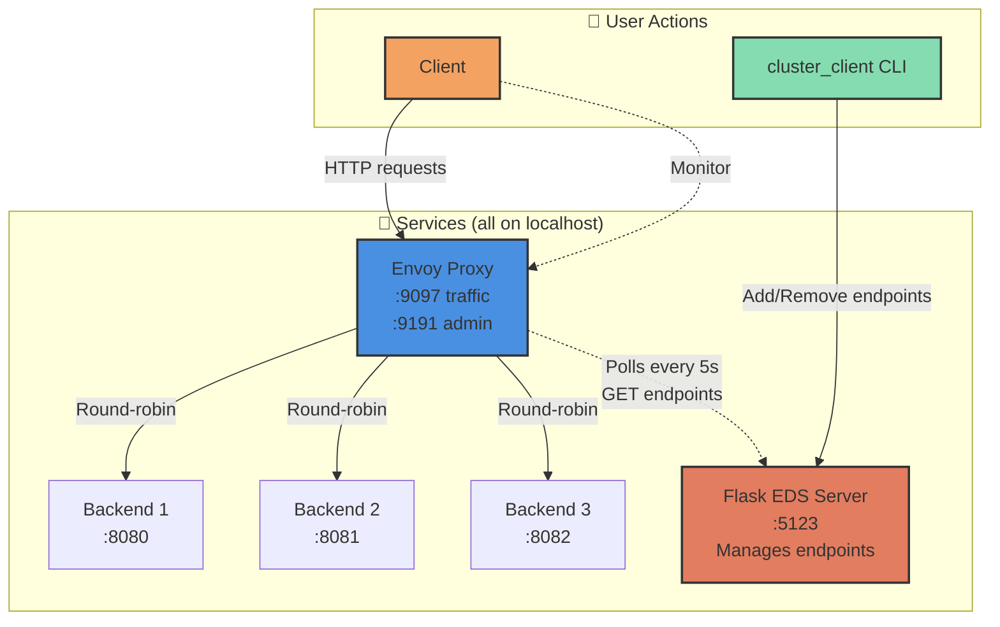

# Envoy Service Discovery

Simple dynamic service discovery for Envoy Proxy using a Flask-based Endpoint Discovery Service (EDS).

**Note:** This demo is designed to run all components on a single machine (localhost).

## What It Does

Dynamically add/remove backend servers to Envoy without restarting.



## Quick Start

### 1. Start Flask EDS Server

```bash
python3 envoy/cluster_sd.py
```

Server starts on `http://127.0.0.1:5123`

### 2. Start Envoy Proxy

```bash
shifter --image=envoyproxy/envoy:v1.34.0 --module=none envoy -c envoy/config.yaml
```

Envoy listens on:
- **Port 9097** - proxy endpoint (send traffic here)
- **Port 9191** - admin interface

### 3. Start Backend Servers

```bash
# Start 3 test backends on ports 8080, 8081, 8082
./start_backends.sh 3
```

### 4. Register Backends

```bash
./envoy/cluster_client add 127.0.0.1 8080
./envoy/cluster_client add 127.0.0.1 8081
./envoy/cluster_client add 127.0.0.1 8082
```

### 5. Test Load Balancing

```bash
./test_loadbalancer.sh 20
```

**Expected output:**
```
Request 1:
Hello from Backend-1 on port 8080!

Request 2:
Hello from Backend-3 on port 8082!

Request 3:
Hello from Backend-2 on port 8081!

Request 4:
Hello from Backend-1 on port 8080!
...
```

## Managing Endpoints

### View registered endpoints
```bash
./envoy/cluster_client show
```

### Add an endpoint
```bash
./envoy/cluster_client add <ip> <port>
./envoy/cluster_client add 127.0.0.1 8083
```

### Remove an endpoint
```bash
./envoy/cluster_client remove <ip> <port>
./envoy/cluster_client remove 127.0.0.1 8081
```

### Clear all endpoints
```bash
./envoy/cluster_client reset
```

**Note:** Changes take effect within 5 seconds (Envoy's polling interval)

## Monitoring

### Check Envoy status
```bash
# View clusters and endpoints
curl http://localhost:9191/clusters

# View full config
curl http://localhost:9191/config_dump
```

### Check what endpoints Envoy sees
```bash
curl http://localhost:9191/clusters | grep test-cluster -A 20
```

## Cleanup

```bash
# Stop all processes
pkill -f backend_server.py
pkill -f cluster_sd.py
pkill envoy
```

## File Structure

```
envoy_service_discovery/
├── envoy/
│   ├── cluster_sd.py       # Flask EDS server
│   ├── config.yaml         # Envoy configuration
│   └── cluster_client      # CLI tool for managing endpoints
├── backend_server.py       # Test backend server
├── start_backends.sh       # Script to start multiple backends
├── test_loadbalancer.sh    # Script to test load balancing
└── README.md
```
